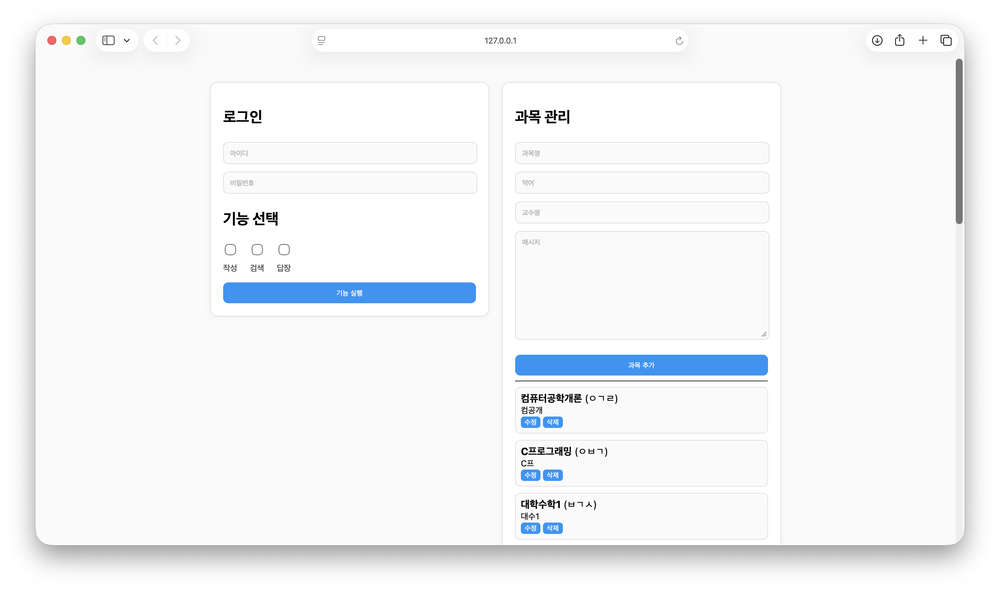
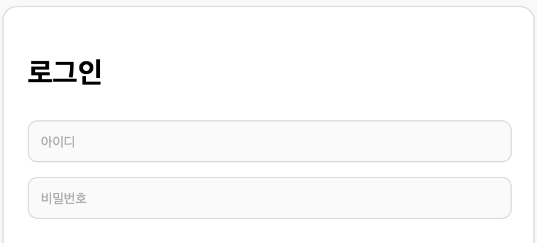
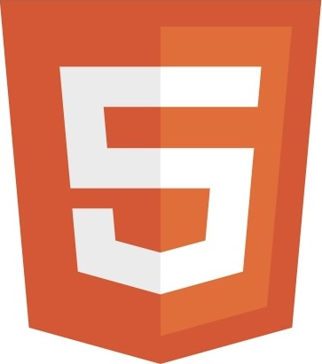
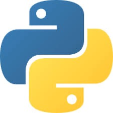
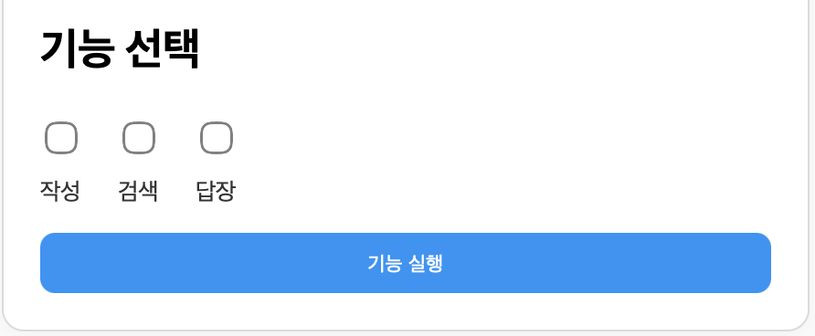
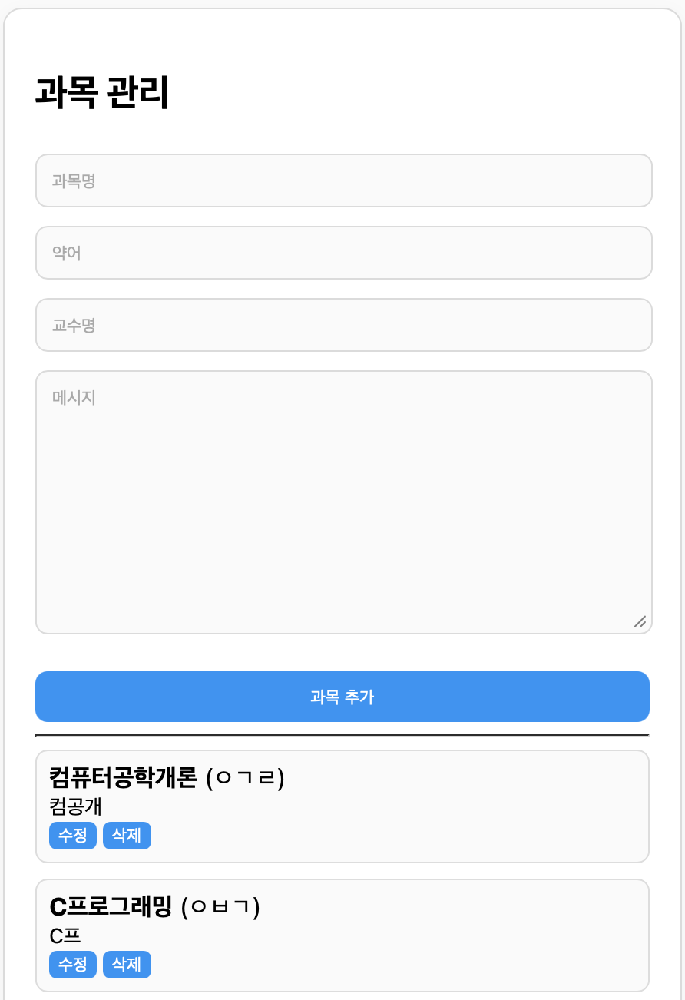

<h2><a href="">DOK-jokbo</a></h2>

<h2>Purpose</h2>

이 프로젝트는 족보 판매의 불편함을 해결하기 위해 저의 편의를 중심으로 개발되었습니다.

<h2>Element</h2>
<h3>로그인</h3>

이 요소는 빠르게 로그인 할 수 있도록 로그인 자동화 기능을 제공합니다.

    HTML
    CSS
    JavaScript
    Python

<h3>기능 선택</h3>

이 요소는 족보 판매의 필요한 작성, 검색, 답장 자동화 기능을 제공합니다.

    HTML
    CSS
    JavaScript
    Python

<h3>과목 관리</h3>

이 요소는 족보 판매 과목을 관리하는 기능을 제공합니다.

    HTML
    CSS
    JavaScript
    Python

